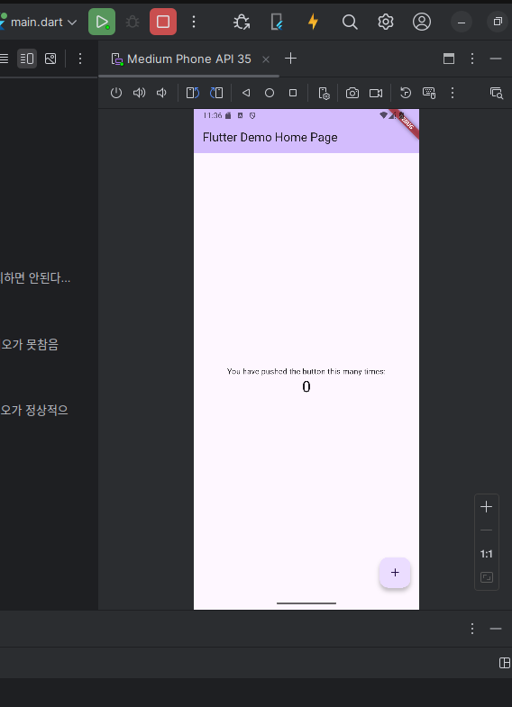
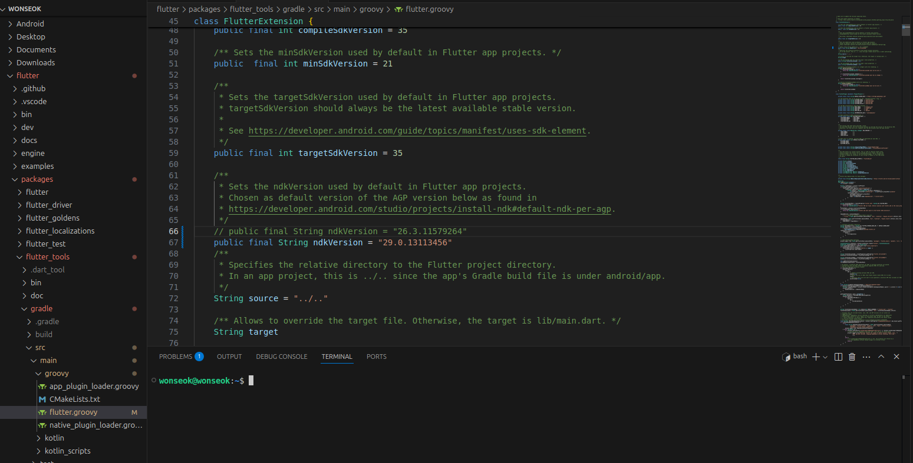

# todo  

FirstTodoApp

처음으로 플루터를 설치함.

ubuntu 환경이라 설치가 잘안됨...

플루터를 우분투에 설치할때 리눅스 앱스토어에서 설치하면 안된다...

앱스토어로 설치하면 snap으로 설치됨...
그리고..

애뮬레이터나 ndk도 cli로 설치하면
안드로이드 스튜디오가 못참음

안드로이드 스튜디오만 설치하고

세팅들어가서 sdk 검색후 설치해야 안드로이드 스튜디오가 정상적으로

애뮬레이터와 ndk를 인식함

그냥 설치하면 못찾는다..

ndk 파일 위치! 
